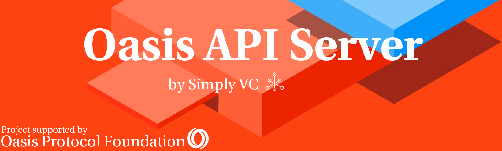

# Oasis API Server

The Oasis API Server is a wrap-around of the [Oasis Protocol Golang API](https://github.com/oasisprotocol/oasis-core). This makes it easier to use the protocol's API with any programming language in order to query data from the Oasis nodes. This server is also able to query data from the Oasis nodes' exposed Prometheus endpoint.

The API Server was specifically built as a way for PANIC to be able to retrieve data from the Oasis nodes that it will be monitoring. Apart from retrieving data from the protocol's API, this server can retrieve data from the exposed Prometheus endpoint.

If you would like any endpoint specified in the Oasis docs to be implemented, kindly open an issue and we will consider adding it in a future release. You might also want to have a look at our contribution guidelines, especially if you want to try adding it yourself.

## Design and Features

If you want to dive into the design and feature set of the API Server [click here](docs/DESIGN_AND_FEATURES.md).

## Ready, Set, Query!

If you are ready to try out the API Server on your Oasis nodes, setup and run the API Server using [this](docs/INSTALL_AND_RUN.md) guide.