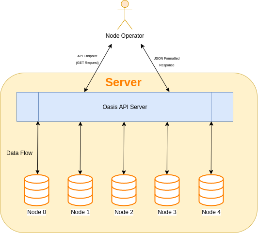

# Design and Features of the Oasis API Server

This page will present the inner workings of the API Server as well as the features that one is able to interact with and how. The following points will be presented and discussed:

- [**Design**](#design)
- [**Complete List of Endpoints**](#complete-list-of-endpoints)
- [**Using the API**](#using-the-api)

## Design

The components involved in the API Server are the following:
- The **Oasis Nodes** from which the API retrieves information
- This **API Server** uses Multiple Oasis API clients to retrieve data from the Oasis nodes.
- The **User/Program** which sends `GET Requests` to the `API Server` as per the defined Endpoints, and receives JSON formatted responses from the `API Server`

The diagram below gives an idea of the various components at play when the API Server is running, and how they interact with each other and the user/program:



The API Server works as follows:
- The API Server loads the configuration containing the internal socket information for each node from the `config/user_config_nodes.ini` file together with the port at which the API will expose its endpoints taken from the `config/user_config_main.ini` file.
- The API Server has an option to also retrieve the data of Sentries connected to the node through the External URl and tls certificate data of the Sentry. This data is set up in the `config/user_config_sentry` file.
- The API Server loads the information containing Prometheus endpoints from the `config/prometheus_config_main.ini` file which will be used to query blockchain data.
- The API Server loads the Node Exporter endpoint from the `config/node_exporter_nodes.ini` file which will be used to query machine data running the nodes.
- By communicating through this port, the API Server receives the endpoints specified in the `Complete List of Endpoints` section below, and requests information from the nodes it is connected to accordingly.
- Once a request is received for an endpoint the server will read the query which should contain the name of the node that will be queried, it then attempts to establish a connection to the node and request data from it. This data is then foramtted into JSON and returned.
- The server interacts with the protocol API through these clients :
    1. [Consensus Client](https://godoc.org/github.com/oasislabs/oasis-core/go/consensus/api#ClientBackend)
    2. [Registry Backend](https://godoc.org/github.com/oasislabs/oasis-core/go/registry/api#Backend)
    3. [Staking Backend](https://godoc.org/github.com/oasislabs/oasis-core/go/staking/api#Backend)
    4. [Scheduler Backend](https://godoc.org/github.com/oasislabs/oasis-core/go/scheduler/api#Backend)
    5. [NodeController](https://godoc.org/github.com/oasislabs/oasis-core/go/control/api#NodeController)
    6. [Sentry](https://godoc.org/github.com/oasislabs/oasis-core/go/sentry/api#Backend)

## Complete List of Endpoints
| API Endpoint                     | Required Inputs                 | Optional Inputs | Output                    | Description                                                                         |
|----------------------------------|---------------------------------|-----------------|---------------------------|-------------------------------------------------------------------------------------|
| /api/ping/                            | none                            | none            | Pong                      | 
| /api/getconnectionslist/              | none                            | none            | List of Connections       |
| /api/consensus/genesis/               | Node Name                       | Height          | Consensus Genesis State   | 
| /api/consensus/epoch/                 | Node Name                       | Height          | Epoch                     | 
| /api/consensus/block/                 | Node Name                       | Height          | Block Object              | 
| /api/consensus/blockheader/           | Node Name                       | Height          | Block Header Object       | 
| /api/consensus/blocklastcommit/       | Node Name                       | Height          | Block Last Commit Object  | 
| /api/consensus/transactions/          | Node Name                       | Height          | List of Transactions      | 
| /api/pingnode/                        | Node Name                       | None            | Pong                      | 
| /api/registry/entities/               | Node Name                       | Height          | List of Entities          | 
| /api/registry/nodes/                  | Node Name                       | Height          | List of Nodes             | 
| /api/registry/runtimes/               | Node Name                       | Height          | List of RunTimes          | 
| /api/registry/genesis/                | Node Name                       | Height          | Genesis State of Registry | 
| /api/registry/entity/                 | Node Name, Entity Public Key    | Height          | Entity                    | 
| /api/registry/node/                   | Node Name, Node Public Key      | Height          | Node                      | 
| /api/registry/runtime/                | Node Name, Runtime Namespace    | Height          | Runtime                   | 
| /api/staking/totalsupply/             | Node Name                       | Height          | Total Supply              | 
| /api/staking/commonpool/              | Node Name                       | Height          | Common Pool               | 
| /api/staking/genesis/                 | Node Name                       | Height          | Staking Genesis State     | 
| /api/staking/threshold/               | Node Name, kind                 | Height          | Threshold                 | 
| /api/staking/accounts/                | Node Name                       | Height          | List of accounts          |
| /api/staking/accountinfo/             | Node Name, Account Public Key   | Height          | Account information       | 
| /api/staking/delegations/             | Node Name, Account Public Key   | Height          | Delegations               | 
| /api/staking/debondingdelegations/    | Node Name, Account Public Key   | Height          | DebondingDelegations      | 
| /api/nodecontroller/synced/           | Node Name                       | None            | Synchronized State        | 
| /api/scheduler/validators/            | Node Name                       | Height          | List of Validators        | 
| /api/scheduler/committees/            | Node Name, Namespace            | Height          | Committees                | 
| /api/scheduler/genesis/               | Node Name                       | Height          | Scheduler Genesis State   | 
| /api/prometheus/gauge/                | Node Name, Gauge Name           | none            | Gauge Value               | 
| /api/prometheus/counter/              | Node Name, Counter Name         | none            | Counter Value             | 
| /api/exporter/gauge/                  | Node Name, Gauge Name           | none            | Gauge Value               | 
| /api/exporter/counter/                | Node Name, Counter Name         | none            | Counter Value             | 
| /api/system/memory/                   | none                            | none            | Memory Stats              | 
| /api/system/cpu/                      | none                            | none            | CPU Stats                 |
| /api/system/disk/                     | node                            | none            | Disk Stats                |
| /api/system/network/                  | node                            | none            | Network Stats             |
| /api/sentry/addresses/                | Node Name                       | none            | Nodes Connected to Sentry |

## Using the API

For example, the endpoint `/api/staking/synced` can be called as follows: `http://localhost:8880/api/staking/synced?name=Oasis_Local`.
If successful, this will return:
```json
{
    "issynced": true
}
```

If an API connection for the node specified in the `websocket` field is not online, this will return:
```json
{
    "error": "Failed to get IsSynced!"
}
```

[Back to API front page](../README.md)
